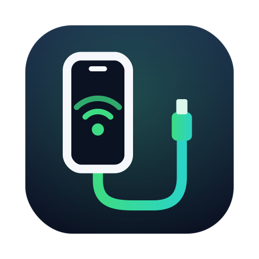

<p align="center">
  
</p>

<h1 align="center">TetherKitNext</h1>

<p align="center">
  <b>在 Mac 上使用 Android 手机的 USB 网络共享。</b><br>
  不装内核扩展，不降低安全设置，什么都不用关。
</p>

<p align="center">
  <a href="README.md">English</a> · <b>简体中文</b>
</p>

<p align="center">
  <sub>由 <a href="https://issen.kurokamicorp.com/"><b>Issen Software Group</b></a> 开发 · 基于 XiaoMiku01 的 <a href="https://github.com/XiaoMiku01/TetherKit">TetherKit</a></sub>
</p>

---

## 它能做什么

macOS 不支持 Android 手机的「USB 网络共享」（这种协议叫 RNDIS）。插上手机、打开 USB 网络共享后，
Mac 上什么也不会发生。

TetherKitNext 解决的就是这个问题：它通过 USB 与手机通信，给 macOS 提供一条正常的网络连接，
让 Mac 借用手机的移动数据或 Wi-Fi 上网。

- **Apple Silicon 与 Intel 的 Mac 都能用**，需要 macOS 14 Sonoma 或更高版本
- **无需关闭任何东西**：SIP 保持开启，安全设置保持原样
- **一键连接**：插上手机，点「连接」，就能上网
- **常驻菜单栏**，可选显示实时网速
- **附带命令行工具**，方便脚本与进阶用户
- **中英双语界面**

真机实测（USB 2.0）：**下载约 325 Mbps / 上传 240–300 Mbps**，接近数据线本身的上限。

> **TetherKitNext** 由 [**Issen Software Group**](https://issen.kurokamicorp.com/) 开发，是 XiaoMiku01 的
> [TetherKit](https://github.com/XiaoMiku01/TetherKit) 的分支，驱动本身归功于原作者。
> TetherKitNext 提供 Apple Silicon 与 Intel 通用的签名安装包、重新设计的界面、安全审计
> （[docs/SECURITY-AUDIT.md](docs/SECURITY-AUDIT.md)）以及多项修复。详见 [NOTICE.md](NOTICE.md)。

---

## 安装

1. 从 [Releases 页面](https://github.com/AA-EION/TetherKitNext/releases) 下载最新的 **TetherKitNext .dmg**。
2. 打开它，把 **TetherKitNext** 拖进 **应用程序**。
3. 从“应用程序”文件夹打开 TetherKitNext。
4. 点击 **启用后台组件**。macOS 会请你在 **系统设置 › 通用 › 登录项与扩展** 里允许一次：
   打开 TetherKitNext 旁边的开关后回到 App，它会自动继续。

就这样。TetherKitNext 需要的一切都在 App 里，不用再下载或安装别的东西。

> **测试版（标记为 “Pre-release”）** 还没有经过 Apple 签名，macOS 第一次会拒绝打开。
> 把 App 拷到“应用程序”后，打开 **系统设置 › 隐私与安全性**，点 **仍要打开**；
> 或者在终端里执行：`xattr -dr com.apple.quarantine /Applications/TetherKitNext.app`

### 更新

下载新的 .dmg，替换“应用程序”里的 App 即可。如果后台组件还在运行旧版本，**设置** 页会提供一键重启。

### 卸载

在 App 里打开 **设置 › 后台组件 › 停用…**，然后把 TetherKitNext 拖到废纸篓。

### 从 TetherKit 0.2.0 测试版升级

0.2.0 beta 3 及之前的测试版名叫 **TetherKit**。TetherKitNext 1.0 换了名字和标识，会装在旧 App
**旁边**而不是覆盖它。请先移除旧版，免得两者同时抢用手机：

1. 打开旧的 **TetherKit**，如果已连接，先点 **断开**。
2. 打开 **设置 › 后台组件 › 停用…** 并确认。这会停止旧的后台组件，并移除旧的 `tetherkit-cli` 命令。
3. 退出 TetherKit（菜单栏图标 › **退出**），把“应用程序”里的 **TetherKit** 拖到废纸篓。
4. 然后按上面的步骤安装 TetherKitNext。

如果旧 App 已经删掉或打不开，可以在终端里执行：

```bash
sudo launchctl bootout system/com.tetherkit.helperd 2>/dev/null   # 停止旧的后台组件
sudo rm -f /usr/local/bin/tetherkit-cli                             # 旧的命令行链接
defaults delete com.tetherkit.app 2>/dev/null                       # 旧 App 的设置
```

之后看一下 **系统设置 › 通用 › 登录项与扩展**，如果还列着 **TetherKit** 就把它关掉。
**系统设置 › 网络** 里残留的 **TetherKit (feth…)** 会在 TetherKitNext 的后台组件启动时自动清除，
也可以手动删除（选中后 **⋯ › 删除服务**）。

---

## 使用方法

1. 用 USB 线连接手机（必须是**数据线**，很多便宜的线只能充电）。
2. 在手机上打开 **USB 网络共享**（通常在 *设置 › 网络和互联网 › 热点与网络共享*）。
3. 在 TetherKitNext 里点 **连接**。

TetherKitNext 会建立连接并自动获取地址（DHCP），马上就能上网。窗口里会显示连接状态、实时网速和 IP 地址。

侧边栏有五个页面：

| 页面 | 内容 |
|---|---|
| **概览** | 状态、实时网速图、IP 地址 |
| **设备** | 选择使用哪台手机（有多台时），以及几个高级选项 |
| **网络** | 自动（DHCP）或手动静态 IP、DNS，以及是否让*所有*流量都走手机 |
| **日志** | 实时日志，出问题时很有用 |
| **设置** | 后台组件、命令行工具、语言、菜单栏、登录时打开、更新 |

**关闭窗口不会断网。** TetherKitNext 会退到菜单栏（程序坞图标消失），连接保持不断。点菜单栏图标可以
查看网速、连接或断开、重新打开窗口。即使退出 App，连接也会继续。

**支持 VPN。** 自动（DHCP）模式下，连接会注册为 macOS 的正规网络服务，FortiClient 等 VPN 都能正常使用。

**语言**：可随时在 TetherKitNext 菜单、菜单栏面板或设置里切换：跟随系统 / English / 中文。

**更新**：TetherKitNext 每天检查一次本项目的 GitHub 发布，有新版本时会提示你（可在设置中关闭）。
它从不自行下载或安装任何东西。

---

## 命令行工具

App 自带 `tetherkitnext-cli`。想在任何终端里使用它，打开 **设置 › 命令行工具**，点 **安装命令**
（会添加到 `/usr/local/bin`）。

```bash
tetherkitnext-cli --list          # 能识别到我的手机吗？（不需要密码）
sudo tetherkitnext-cli            # 建立连接（需要输入密码）
```

使用命令行时，地址需要你自己配置（在另一个终端窗口里）：

```bash
sudo ipconfig set feth0 DHCP
ipconfig getifaddr feth0      # 显示获取到的地址
```

按 **Ctrl-C** 即可干净地断开。

常用选项（`tetherkitnext-cli --help` 查看全部）：

| 选项 | 作用 |
|---|---|
| `--list` | 列出识别到的设备后退出 |
| `--vid` / `--pid` | 连接了多台设备时指定其中一台 |
| `--stats 1000` | 每秒打印一次网速与错误计数 |
| `--log debug` | 非常详细的日志，用于排查问题 |
| `--lang en\|zh\|auto` | 输出语言（默认跟随系统） |

提示：`sudo` 不一定会传递你的语言设置，如果输出语言不对，请加上 `--lang zh` 或 `--lang en`。

---

## 故障排查

| 问题 | 可以尝试 |
|---|---|
| **「未检测到设备」** | 换一根线（很多线只能充电）；确认手机上的 USB 网络共享**已打开**；解锁手机，并允许弹出的「信任此电脑」/ USB 提示 |
| **卡在「在系统设置中允许 TetherKitNext」** | 打开 **系统设置 › 通用 › 登录项与扩展**，打开 TetherKitNext 的开关。确认 App 在**应用程序**文件夹里运行，而不是直接从下载的磁盘映像里运行 |
| **已连接但上不了网** | 先确认手机本身的移动数据或 Wi-Fi 能用；如果 Mac 同时连着其他网络，在**网络**页打开「所有流量走此网卡」 |
| **提示设备被其他程序占用** | 有别的程序占着手机的 USB 连接，常见的是旧的 HoRNDIS。卸载后重启 |
| **速度慢** | 换 USB 3 接口与短而好的线；关闭其他网络共享工具。调优方法见 [docs/PERFORMANCE.md](docs/PERFORMANCE.md) |
| **其他问题** | **日志**页会显示发生了什么。提 [issue](https://github.com/AA-EION/TetherKitNext/issues) 时请附上 |

---

## 常见问题

**不用它，Mac 能直接用 Android 的 USB 网络共享吗？**
不能。macOS 没有这种驱动，手机根本不会显示为一个网络连接。

**需要关闭 SIP，或者在 Apple Silicon Mac 上降低安全性吗？**
不需要。那是 HoRNDIS 这类旧式内核驱动才需要的。TetherKitNext 是普通 App，从不往 macOS 内核里加载任何东西。

**我以前用 HoRNDIS，为什么要换？**
HoRNDIS 是内核扩展，新版 macOS 会拦截它；在 Apple Silicon 上还需要进恢复模式降低安全设置。
TetherKitNext 做同样的事，却完全不需要这些。

**哪些设备能用？**
大多数开启了 USB 网络共享的 Android 手机，以及一些 Linux 开发板（树莓派 Zero、BeagleBone）和旧款
Windows 手机。可以运行 `tetherkitnext-cli --list` 检查你的设备。

**iPhone 需要这个吗？**
不需要，macOS 原生支持 iPhone 的 USB 网络共享。

**安全吗？**
App 以你的普通用户身份运行。需要管理员权限的那一小部分（创建网络连接）在一个独立的后台组件里运行：
它只接受正版 TetherKitNext App 的请求，并在做出更改前要求输入密码。完整的安全审计见
[docs/SECURITY-AUDIT.md](docs/SECURITY-AUDIT.md)。

---

## 工作原理（简版）

```
 Android 手机 ──USB──▶ TetherKitNext ──▶ 虚拟网卡 ──▶ macOS 网络栈
                       （通过 USB 说     （macOS 自带的
                        RNDIS 协议）      「feth」接口）
```

TetherKitNext 通过 [libusb](https://libusb.info/) 用 RNDIS 协议与手机通信，再把网络流量交给 macOS
自带的一对虚拟网卡（`feth`）。macOS 把它当成普通网卡：分配地址、路由、DNS 一应俱全。全部代码都运行在
内核之外，出了 bug 最多是 App 退出，而不会让整台 Mac 崩溃。

更多细节：[docs/DESIGN.md](docs/DESIGN.md) · [docs/RNDIS-PROTOCOL.md](docs/RNDIS-PROTOCOL.md) ·
[docs/GUI-ARCHITECTURE.md](docs/GUI-ARCHITECTURE.md)

---

## 开发者

### 构建

需要 macOS 14+、**Xcode 26** 与 CMake 3.24+。

```bash
# 全部：通用 App + 磁盘映像，并跑完所有测试
./scripts/build-release.sh
# → dist/TetherKitNext.app 与 dist/TetherKitNext-<版本>.dmg
```

只构建命令行工具：

```bash
./scripts/build-libusb.sh "$PWD/build/libusb-universal"
cmake -S . -B build -DLibUSB_ROOT="$PWD/build/libusb-universal"
cmake --build build -j
ctest --test-dir build          # 运行测试
```

本地构建默认是 ad-hoc 签名，这种构建 macOS 不会启用后台组件。要完整试用 App，请用你自己的 Apple 证书签名：

```bash
export TETHERKITNEXT_SIGN_IDENTITY="Developer ID Application: 你的名字 (TEAMID)"
./scripts/build-release.sh
```

### 发布

每次推送都会在 GitHub Actions 的 Apple Silicon 与 Intel Mac 上构建并测试。推送标签即发布：

- `v0.3.0` → 正式版（必须配置签名密钥：DMG 会经 Apple 签名并公证）
- `v0.3.0-beta.1` → 预发布版（可以不签名，用于测试）

正式版需要的仓库密钥：

| 密钥 | 内容 |
|---|---|
| `MACOS_CERTIFICATE_P12` | 「Developer ID Application」证书及私钥，导出为 .p12 后的 base64 |
| `MACOS_CERTIFICATE_PASSWORD` | 导出 .p12 时设置的密码 |
| `NOTARY_KEY_P8` | App Store Connect API 密钥（.p8）的 base64 |
| `NOTARY_KEY_ID`、`NOTARY_ISSUER_ID` | 该密钥的 ID 与你的 Issuer ID（在 App Store Connect 查看） |

实现备忘与踩过的坑见 [AGENTS.md](AGENTS.md)。

---

## 许可

MIT，见 [LICENSE](LICENSE)。
Copyright © 2026 Issen Software Group；Copyright © 2026 TetherKit contributors（原版
[TetherKit](https://github.com/XiaoMiku01/TetherKit)，其 MIT 版权声明按许可证要求保留在 LICENSE 中）。

TetherKitNext 内置 [libusb](https://libusb.info/)（LGPL-2.1），其许可证文本随 App 一起提供
（*设置 › 关于 › 查看许可证*）。详见 [NOTICE.md](NOTICE.md)。
